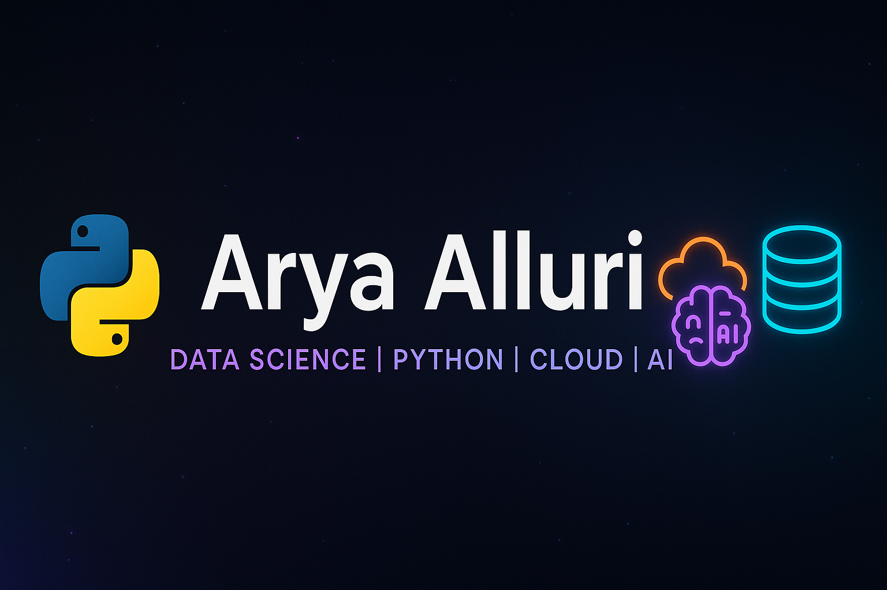

<!-- Banner -->

## 👋 About Me
- 🎓 Graduate Student at the University of North Texas (MS in Data Science)  
- 💻 Aspiring Data Engineer / Python Full Stack Developer  
- 📊 Passionate about cloud data platforms, AI, and building production-ready solutions

---

## 🛠 Tech Stack

**Languages & Core**  

**Backend**  

**Frontend**  

**Data Science & AI**  

**Cloud**  

**Data Engineering**  

**DevOps**  

---

## 📊 GitHub Stats
  
  

---

## 📌 Fun Fact
💡 I believe in writing code that not only works but also tells a story — clean, scalable, and impactful.
